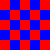
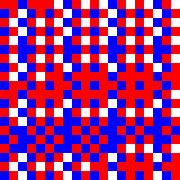

# Schelling's Model of Segregation Simulation

A Ruby implementation of Thomas Schelling's model of segregation, demonstrating how individual preferences can lead to emergent patterns of segregation in populations.

## Overview

This simulation demonstrates Schelling's segregation model, which shows how small individual biases can lead to large-scale segregation patterns. The model proves that even a mild preference for similar neighbors can result in significant segregation over time.

## Usage

first create a map file and then run the simulation

```bash
ruby main.rb
```

## How It Works

1. The simulation creates a grid populated with two types of agents (represented by different colors)
2. Each agent has a preference for having similar neighbors
3. If an agent's neighborhood doesn't meet their similarity threshold, they move to a random empty cell
4. The process continues until all agents are satisfied or maximum iterations are reached

## Samples




